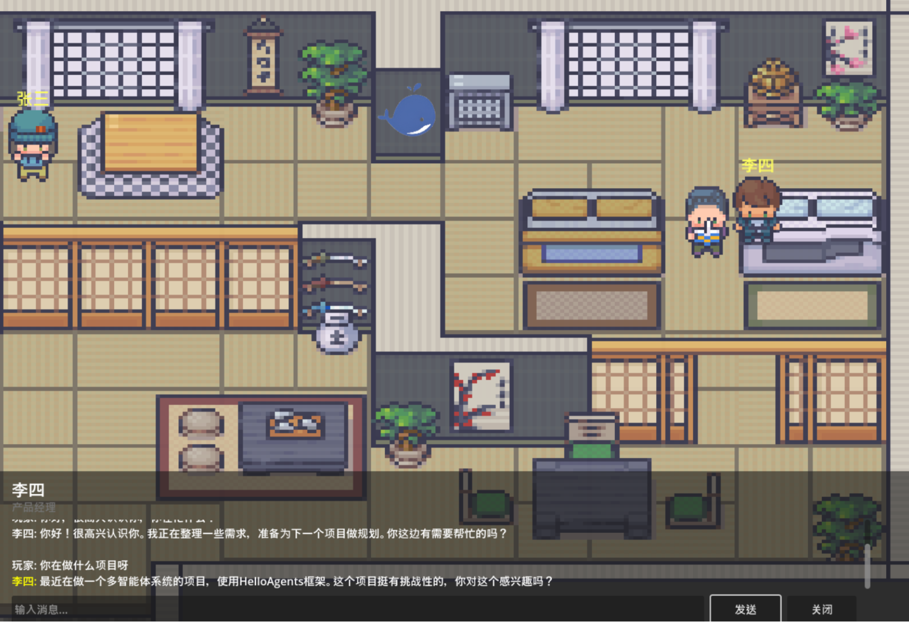

<div align="center">

# 🌆 AI Npc Town · 赛博小镇

**Godot + FastAPI + LLM Agent 构建的 AI NPC 交互系统**

[](https://godotengine.org/)
[](https://fastapi.tiangolo.com/)
[](https://www.python.org/)
[](https://qdrant.tech/)
[](./LICENSE)

[中文](README.md) | [English](README.en.md)

> **项目状态：开发中** — 核心系统已跑通，代码整理与文档完善进行中。

</div>

---

## 项目构想

传统游戏中的 NPC 只能说出固定台词，或通过预设对话树进行有限互动——即便最复杂的 RPG，人物对话也是编剧事先写好的。这种方式可控，但缺乏真正的"生命力"。

本项目探索另一个方向：**当游戏 NPC 接入大语言模型**。玩家可以用自然语言自由交流，NPC 拥有各自的角色设定、说话风格与长期记忆，会记得你上次说了什么、你们的关系如何、你的偏好是什么，并据此调整态度。

### 核心玩法

| 模块 | 说明 |
|------|------|
| **自然语言对话** | 玩家可与 NPC 自由交流，无预设选项限制 |
| **记忆系统** | 短期 + 长期记忆，检索相关历史后生成回复 |
| **好感度系统** | 态度随互动演化：陌生 → 熟悉 → 友好 → 亲密 → 挚友 |
| **角色设定** | 每个 NPC 独立的职业、性格、专长与说话风格 |
| **实时日志** | 对话与好感度变化全量记录，可追溯分析 |

## 技术架构

```
┌──────────────────────────────────────────────────────┐
│  前端层 · Godot 4.6                                    │
│  游戏渲染 · 玩家控制 · NPC 显示 · 对话 UI                 │
└───────────────────────┬──────────────────────────────┘
                        │ HTTP API
                        ▼
┌──────────────────────────────────────────────────────┐
│  后端层 · FastAPI                                      │
│  API 路由 · NPC 状态管理 · 对话处理 · 日志记录             │
└───────────────────────┬──────────────────────────────┘
                        │
                        ▼
┌──────────────────────────────────────────────────────┐
│  智能体层 · HelloAgents                                │
│  每个 NPC = 一个 SimpleAgent（独立记忆 + 状态）           │
│  记忆检索 → LLM 生成 → 好感度计算                       │
└───────────────────────┬──────────────────────────────┘
                        │
                        ▼
┌──────────────────────────────────────────────────────┐
│  外部服务层                                            │
│  LLM API  ·  Qdrant 向量数据库  ·  SQLite 持久化          │
└──────────────────────────────────────────────────────┘
```

### 数据流转

```
玩家按 E 键
   → Godot 发送对话请求 (HTTP)
   → FastAPI 路由到对应 NPC
   → SimpleAgent 从记忆系统检索相关历史
   → 调用 LLM 生成回复
   → 更新 NPC 状态与好感度
   → 记录日志（控制台 + 文件）
   → 返回回复给 Godot
   → UI 更新，完成一次交互循环
```

## NPC 角色设定

| NPC | 职业 | 性格 | 说话风格 |
|-----|------|------|----------|
| **张三** | Python 工程师 | 技术宅，喜欢讨论算法和框架 | 简洁专业，爱用技术术语，偶尔吐槽 bug |
| **李四** | 产品经理 | 外向健谈，善于沟通协调 | 友好热情，善用比喻 |
| **王五** | UI 设计师 | 细腻敏感，注重美感 | 注重表达与呈现的层次感 |

> 每个 NPC 的设定（职业 / 位置 / 行为 / 性格 / 专长 / 风格 / 爱好）均为结构化配置，Agent 在生成回复时以角色 Prompt 注入。

## 效果展示

<div align="center">
  
  <br><em>图 1 · 像素风格办公室场景，WASD 移动，靠近 NPC 显示交互提示</em>
  <br><br>
  
  <br><em>图 2 · 与 NPC 的自然语言对话界面</em>
</div>

## 项目结构

```
AI-Npc-Town/
├── helloagents-ai-town/           # Godot 游戏项目
│   ├── project.godot              #   Godot 项目配置
│   ├── scenes/                    #   游戏场景
│   │   ├── main.tscn              #     主场景（办公室）
│   │   ├── player.tscn            #     玩家角色
│   │   ├── npc.tscn               #     NPC 角色
│   │   └── dialogue_ui.tscn       #     对话 UI
│   ├── scripts/                   # GDScript 脚本
│   │   ├── main.gd                #     主场景逻辑
│   │   ├── player.gd              #     玩家控制
│   │   ├── npc.gd                 #     NPC 行为
│   │   ├── dialogue_ui.gd         #     对话 UI 逻辑
│   │   ├── api_client.gd          #     API 客户端
│   │   └── config.gd              #     配置管理
│   └── assets/                    #   游戏资源
│       ├── characters/            #     角色精灵图
│       ├── interiors/             #     室内场景
│       ├── ui/                    #     UI 素材
│       └── audio/                 #     音效音乐
│
├── backend/                       # Python 后端
│   ├── main.py                    #   FastAPI 主程序
│   ├── agents.py                  #   NPC Agent 系统（角色配置 + 记忆）
│   ├── relationship_manager.py    #   好感度管理
│   ├── state_manager.py           #   NPC 状态管理
│   ├── memory_data/               #   记忆数据
│   ├── models.py                  #   数据模型
│   ├── logger.py                  #   日志系统
│   ├── config.py                  #   配置管理
│   ├── view_logs.py               #   日志查看工具
│   ├── batch_generator.py         #   批量数据生成
│   └── requirements.txt           #   Python 依赖
│
└── docs/                          # 文档
    ├── MEMORY_SYSTEM_GUIDE.md     #   记忆系统设计
    ├── AFFINITY_SYSTEM_GUIDE.md   #   好感度系统设计
    ├── DIALOGUE_LOG_GUIDE.md      #   对话日志规范
    └── SETUP_GUIDE.md             #   环境搭建指南
```

## 环境搭建

### 前置要求

- **Godot** ≥ 4.6 — [下载](https://godotengine.org/download)
- **Python** ≥ 3.10
- **LLM API Key** — 在 `.env` 中配置

### 1. 启动后端

```bash
cd backend
python -m venv .venv && source .venv/bin/activate   # Windows: .venv\Scripts\activate
pip install -r requirements.txt
uvicorn main:app --reload
```

### 2. 配置 API Key

在 `backend/.env` 中填入你的 LLM API Key 与相关配置。

### 3. 启动游戏

用 Godot 打开 `helloagents-ai-town/project.godot`，运行主场景。

### 4. 操作方式

| 按键 | 功能 |
|------|------|
| `W A S D` | 移动角色 |
| `E` | 与附近 NPC 交互 |

> 详细步骤见 `docs/SETUP_GUIDE.md`

## 好感度系统

好感度在后端实现——每次对话根据玩家消息的内容与情感分析调整好感度值。

虽然游戏界面暂未直接显示好感度数值，但所有变化都会被记录到 `backend/logs/dialogue_YYYY-MM-DD.log`：

| 日志字段 | 说明 |
|----------|------|
| 当前好感度值 | 该 NPC 与玩家的关系阶段 |
| 检索到的相关记忆 | Agent 生成回复时参考的历史 |
| NPC 回复内容 | Agent 的实际输出 |
| 好感度变化量 | 如 `+2.0`、`+3.0` |
| 变化原因 | 友好问候、正常交流等 |
| 情感分析结果 | `positive` / `neutral` 等 |

> 详细设计见 `docs/AFFINITY_SYSTEM_GUIDE.md`

## 开发计划

- [x] Godot 前端场景与角色控制
- [x] FastAPI 后端与 NPC Agent 系统
- [x] 记忆系统（短期 + 长期）
- [x] 好感度系统与日志记录
- [ ] 代码整理与模块化重构
- [ ] 前端好感度可视化 UI
- [ ] 更多 NPC 与场景扩展
- [ ] 记忆检索策略优化

## 思考与展望

AI NPC 展示了 LLM 在游戏中的潜力，但有三个现实挑战：

- **成本** — 每次对话都调用 LLM API，大型多人在线游戏中成本可能难以承受
- **延迟** — LLM 推理需要时间，网络延迟高时玩家需等待数秒
- **内容可控性** — LLM 生成内容不完全可控，需要精心设计提示词与过滤机制

随着推理速度提升与本地小模型的发展，这些约束正在缓解。AI 与游戏的结合会带来传统对话树无法实现的交互体验。

## License

MIT © [lhh737](https://github.com/lhh737)

## Credits

美术资源来自 [Datawhale](https://github.com/datawhalechina)，智能体框架基于 [Hello-Agents](https://github.com/datawhalechina/Hello-Agents)。
